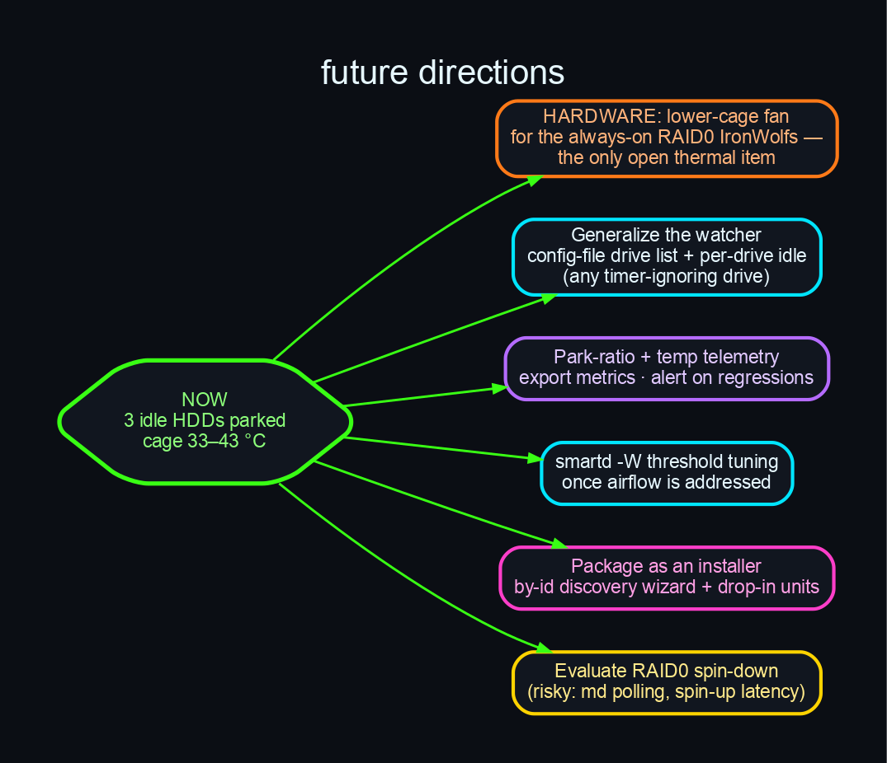

# Future Directions

Where things stand: three idle HDDs park automatically (two via `-S` timer, one via the
watcher), and the lower drive cage settled from ~40–53 °C to ~33–43 °C. Open ideas, roughly in
priority order:

## 1. Hardware: a lower-cage fan (the only open thermal item)

The always-on RAID0 IronWolfs (`sdd`/`sdf`) **cannot be parked** — they back a live, striped
`/mnt/raid0` archive. They're now the warmest drives (42–43 °C). The real remaining fix is
airflow: add or redirect a case fan to the lower drive cage that the RTX 5080/3080 install
displaced. Software has done what it can here.

## 2. Generalise the watcher

`idle-disk-park.sh` currently hard-codes a single device and a 5-minute idle threshold. Turn it
into a small, config-driven daemon:

- a drive list in `/etc/quiescent.conf` (by-id paths), with per-drive idle thresholds;
- auto-classification (probe `-S` vs `-y` once and remember which a drive needs);
- a single timer covering every timer-ignoring drive.

## 3. Park-ratio + temperature telemetry

Export simple metrics — fraction of time each drive is parked, current power state, last temp
read — so the spin-down is observable and regressions (a drive that mysteriously stops parking,
e.g. after a reset clears its `-S` timer) raise an alert instead of going unnoticed. A textfile
collector for `node_exporter` / Netdata would be enough.

## 4. `smartd -W` threshold tuning

Once airflow is improved, revisit the per-drive `smartd -W` temperature thresholds so they
reflect each drive's real envelope (a WD Black is rated ~60 °C) instead of firing nuisance
alarms — but *after* cooling, never as a substitute for it.

## 5. Package as an installer

A `make install` / wizard that: discovers drives by-id, probes each for `-S` vs `-y` behaviour,
generates the right unit (oneshot or watcher entry), and enables it — so adapting `quiescent` to
a new machine doesn't require hand-editing serials into unit files.

## 6. Evaluate (carefully) RAID0 spin-down

Spinning down RAID members is risky — `md` can issue periodic I/O, and spinning a striped array
back up adds latency to the first access — but for a *cold* archive array it might be viable with
a long idle threshold and the forced-`-y` watcher. Worth a controlled experiment, not a default.

## 7. Zero-spin-up shutdown for pure-read archives

A parked drive with a *mounted read-write* filesystem is spun back up at shutdown to flush its
ext4 journal and clear the dirty flag (see Lessons Learned §7) — necessary, but avoidable for a
drive that's never written. If a member of the park set becomes a **pure read archive**, mounting
it **read-only** eliminates the shutdown spin-up entirely (a clean `ro` unmount writes nothing).
Candidate mechanics: `ro` in `fstab` with a documented `mount -o remount,rw` escape hatch for the
rare ingest. Pairs naturally with the park-ratio telemetry (§3) — fold "woke at shutdown?" into
the same metric by parsing unmount durations from `journalctl`.
