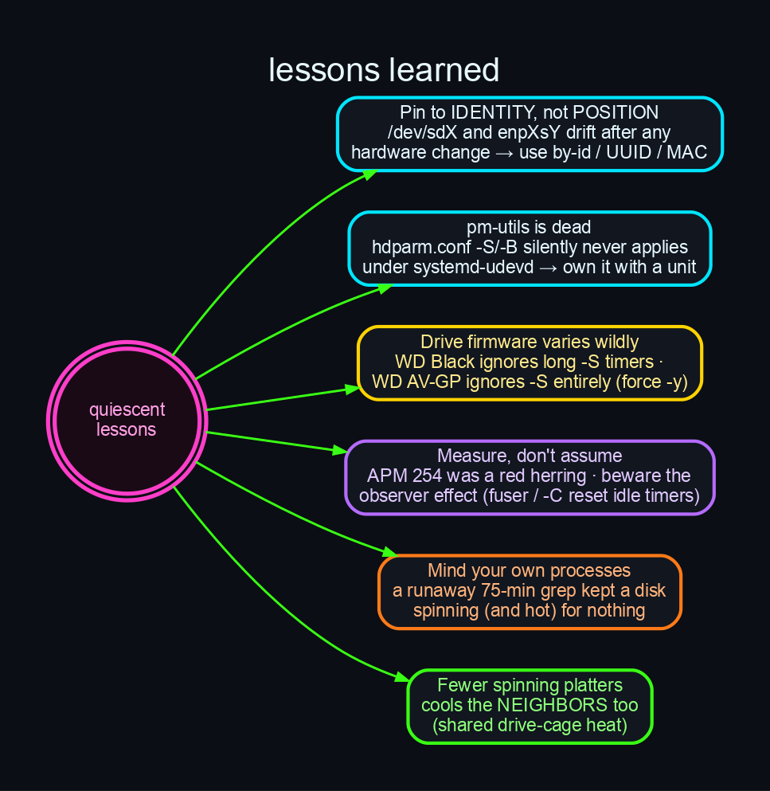

# Lessons Learned

A "spin down idle disks" task turned into a multi-hour investigation. The lessons generalise
well beyond this one machine.

## 1. Pin to *identity*, not *position*

`/dev/sdX` and `enpXsY` encode **bus position**, not device identity. On a machine where the
PCIe topology changes — a GPU swap, a card added, BIOS reorder, a drive added — the kernel
reassigns those names, and **the same physical hardware lands at a different name**. Any config
pinned to the old name silently acts on the wrong device, *without erroring*.

On worlock the RTX 5080/3080 installs drifted the NIC `enp7s0 → enp8s0 → enp9s0` and rotated
SATA letters (the WD Black moved `/dev/sda → /dev/sdg`). Casualties:

- `smartd.conf` applied per-drive temperature thresholds to the **wrong disks**.
- `ethtool@enp8s0` tuned a dead NIC → **~90 s boot timeout**.
- Firewall snapshots, `netplan`, `sysctl`, NetworkManager dispatcher scripts all named a NIC
  that no longer existed.

**Fix:** pin everything to stable identifiers — `/dev/disk/by-id/*` or `UUID` for disks, MAC
for NICs. `fstab` (UUID) and `hdparm.conf` (by-id) were already correct; everything that used
raw names had drifted. *After any hardware change, grep your configs for positional names.*

## 2. `pm-utils` is dead — `hdparm.conf` silently doesn't apply

`hdparm.conf`'s `-S`/`-B` settings are applied at boot by a `udev RUN+=/lib/udev/hdparm` rule
that delegates to `pm-utils`' `95hdparm-apm`. `pm-utils` is deprecated (it showed `un` in
`dpkg`), and that path is unreliable under `systemd-udevd`: it works when you run it by hand,
but **silently no-ops during boot**. Result — drives that `hdparm.conf` *intended* to spin down
came up with no standby timer armed and spun 24/7.

**Fix:** don't trust the legacy path. Own the setting with a deterministic **systemd oneshot**
(or a timer + watcher). The same applies to other "I put it in the config but it didn't take"
hdparm/udev mysteries on modern systemd.

## 3. Drive firmware varies wildly — verify, per drive

Three drives, three behaviours:

- **WD Black (WD4005FZBX):** honors *short* standby timers but **ignores long ones**. `-S 12`
  (1 min) parks reliably; `-S 60` (5 min) and `-S 120` (10 min) never park — verified with the
  drive completely idle (flat block I/O for >10 min).
- **Hitachi (HUA723020ALA640):** honors `-S 12` like the WD Black.
- **WD10EURX (AV-GP / surveillance-class):** ignores the `-S` timer **entirely** and doesn't
  support APM — but **obeys a forced `hdparm -y`**. It's built to spin 24/7 for DVRs.

**Fix:** there is no universal value. Probe each drive: set `-S`, wait, check `hdparm -C`; if it
won't time out, try forced `-y`. Honors timer → oneshot. Obeys only `-y` → software watcher.

## 4. Measure, don't assume — and mind the observer effect

- **APM 254 was a red herring.** The obvious hypothesis ("max-performance APM blocks spin-down")
  was wrong — a 60-second `-S 12` test parked the drive regardless of APM 254.
- **The observer effect is real.** `fuser -m /dev/sdX` *opens* the block device and resets the
  standby idle timer; an early "it didn't park after 10 min" reading was partly self-inflicted.
  `hdparm -C` (CHECK POWER MODE), by contrast, is genuinely non-intrusive — it doesn't reset the
  timer or wake the drive, which makes it the right tool for watching power state.
- You **cannot read a parked drive's temperature without spinning it up** (SMART temp needs the
  drive awake). Plan measurements around that.

## 5. Mind your own processes

A runaway filesystem-wide `grep` — a leftover of *this investigation's own* searches — had been
crawling a 2 TB drive's millions of files for **75 minutes**, keeping it spinning (and warm) for
zero benefit. The drive looked "busy" until we traced the reader. Killing one stray process was
itself a measurable cooling win. Always check *what* is doing the I/O before concluding a drive
is legitimately active.

## 6. Fewer spinning platters cools the neighbours too

The payoff wasn't limited to the parked drives. The always-on RAID0 IronWolfs dropped
**−3…−7 °C without being parked**, purely because their idle neighbours stopped dumping heat
into the shared cage. In a dense, airflow-constrained enclosure, every platter you can stop is
heat you remove from *every* drive around it.
