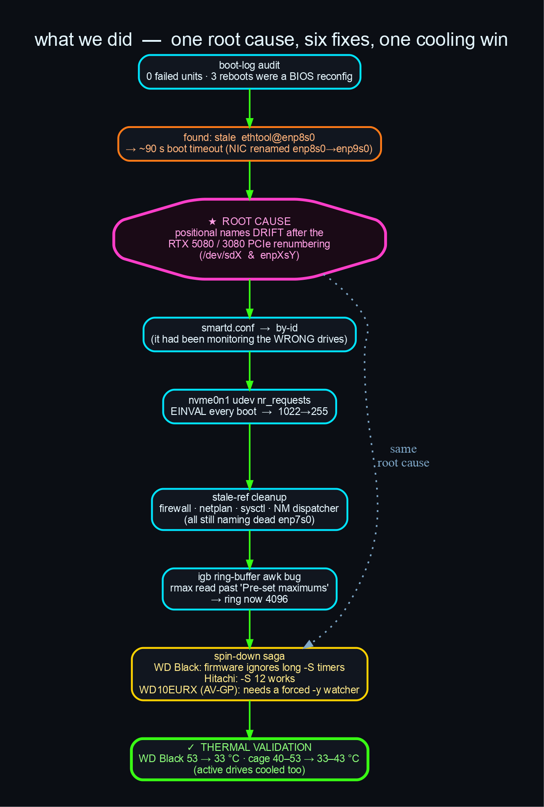
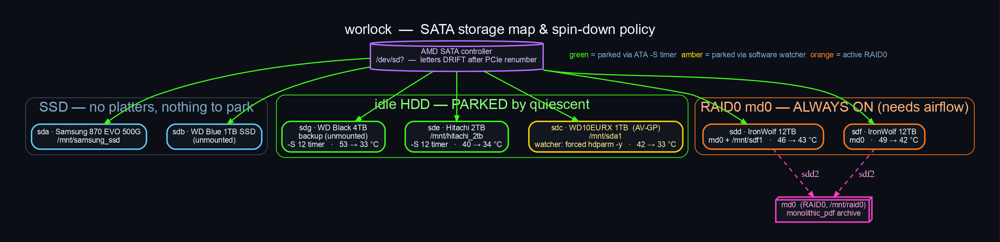
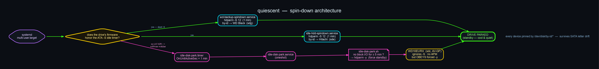

<p align="center">
  
</p>

<p align="center">
  
  
  
  
  
  
</p>

> **Park idle hard drives by stable identity, cut drive-cage heat, and survive the device-name
> drift that GPU PCIe renumbering inflicts on a busy workstation.**
> A systemd + `hdparm` spin-down system, born from a real worlock investigation that took the
> lower drive cage from **~40–53 °C down to ~33–43 °C** — the WD Black backup drive fell **20 °C**.

---

## TL;DR

A multi-GPU workstation (`worlock`: RTX 5080 + RTX 3080) had a hot, airflow-starved drive cage
and several idle HDDs spinning 24/7 for no reason. The fix sounds trivial — "spin down idle
disks" — but it surfaced a chain of real problems: stale device names from PCIe renumbering,
a dead `pm-utils` apply path, and three drives with three *different* firmware behaviours.
`quiescent` is the resulting, verified system:

| Drive | Role | How it parks | Result |
|-------|------|--------------|--------|
| **sdg** WD Black 4TB | unmounted backup | `hdparm -S 12` boot oneshot | 53 → **33 °C** |
| **sde** Hitachi 2TB | `/mnt/hitachi_2tb` | `hdparm -S 12` boot oneshot | 40 → **34 °C** |
| **sdc** WD10EURX 1TB (AV-GP) | `/mnt/sda1` | **software watcher** → forced `hdparm -y` after 5 min idle | 42 → **33 °C** |
| sdd / sdf IronWolf 12TB | RAID0 (active) | *left spinning* — can't park a busy striped array | 46/49 → 43/42 °C |

Everything is pinned by `/dev/disk/by-id/*` so it survives the SATA letter drift that started
the whole investigation.

---

## The problem



The RTX 5080 / 3080 installs **renumbered the PCIe bus**, and the kernel reassigned positional
names as a result — the NIC drifted `enp7s0 → enp8s0 → enp9s0`, and SATA letters rotated (the
WD Black moved `/dev/sda → /dev/sdg`). Anything pinned to a *position* silently started acting
on the *wrong device*:

- `smartd.conf` was applying per-drive temperature thresholds to the **wrong disks** (a WD
  Black judged by an IronWolf threshold).
- `ethtool@enp8s0` pointed at a dead NIC, adding a **~90 s timeout to every boot**.
- Firewall snapshots, `netplan`, `sysctl`, and NetworkManager dispatcher scripts all still
  named the long-gone `enp7s0`.

Underneath that, the drive cage ran hot (GPUs displaced the original airflow) and idle HDDs
were cooking — the WD Black sat at **53 °C** *while unmounted and doing zero I/O*, tripping
`smartd`'s temperature alarm.

## System schematic



## The spin-down system



Spinning an idle disk down is "just" `hdparm -S`. In practice three things got in the way:

1. **The boot-time apply path is broken.** `hdparm.conf` settings are applied via a
   `udev RUN+=/lib/udev/hdparm` rule that delegates `-S`/`-B` to `pm-utils`' `95hdparm-apm`.
   `pm-utils` is deprecated (`un` state) and that path is unreliable under `systemd-udevd` — it
   works from a manual shell but silently no-ops at boot. So the drives came up with **no
   standby timer armed** and spun forever. `quiescent` replaces it with **deterministic systemd
   oneshots** (matching the box's existing `ethtool@` / `nvidia-power-limit` pattern).

2. **Firmware ignores long standby timers.** Empirically, with *nothing* accessing the drives:
   `-S 12` (1 min) parks the WD Black and the Hitachi reliably, but `-S 60` (5 min) and
   `-S 120` (10 min) **never park**. So the oneshots use the proven `-S 12`. (APM 254 looked
   like the culprit — it isn't; the 60-second test parked the drive regardless.)

3. **WD AV-GP drives ignore the standby timer entirely.** The WD10EURX is a surveillance-class
   drive built to spin 24/7 — it ignores `-S` *and* doesn't support APM, but it **does** obey a
   forced `hdparm -y`. So it gets a small **software watcher**: `idle-disk-park.timer` fires
   `idle-disk-park.sh` ~every minute, which issues `hdparm -y` once the drive has had no block
   I/O for 5 minutes. State lives in `/run` (tmpfs), pinned by-id.

`smartd` is configured with `-n standby,q`, so it won't wake a parked drive — once down, drives
stay down (only their own ~4 h offline collection + scheduled self-tests briefly spin them).

## Results

Measured before (all spinning) vs after (parked), per drive:

| Drive | Spinning | Parked | Δ |
|-------|---------:|-------:|--:|
| **sdg** WD Black (parked) | 53 °C | **33 °C** | **−20** |
| **sdc** WD10EURX (parked) | 42 °C | 33 °C | −9 |
| **sde** Hitachi (parked) | 40 °C | 34 °C | −6 |
| sdd IronWolf (still spinning) | 46 °C | 43 °C | −3 |
| sdf IronWolf (still spinning) | 49 °C | 42 °C | −7 |

The `smartd` 53 °C alarm that started this is gone. Note the always-on RAID0 IronWolfs cooled
**−3…−7 °C *without* being parked** — fewer spinning neighbours means less shared-cage heat.
(An incidental win: a runaway filesystem-wide `grep` — a leftover of the investigation's own
searches — had been crawling the Hitachi drive for 75 minutes, keeping it spinning for nothing.
Killing it dropped that drive to idle instantly.)

## Install / adapt to your machine

> These units reference **worlock's** drives by serial. Swap in your own `by-id` names.

```bash
# 1. find your drives' stable names (never use /dev/sdX — it drifts)
ls -l /dev/disk/by-id/ | grep -E 'ata-|nvme-'

# 2. check whether a drive even honors the standby timer
sudo hdparm -S 12 /dev/disk/by-id/ata-YOURDRIVE   # arm 1-min timer
#    ... wait ~90s with the drive idle ...
sudo hdparm -C /dev/disk/by-id/ata-YOURDRIVE       # 'standby' => timer works (use a oneshot)
#    still 'active/idle'? try a forced park:
sudo hdparm -y /dev/disk/by-id/ata-YOURDRIVE       # 'standby' => use the watcher instead

# 3. edit the by-id paths in systemd/*.service and bin/idle-disk-park.sh, then install
sudo install -m0644 systemd/*.service systemd/*.timer /etc/systemd/system/
sudo install -m0755 bin/idle-disk-park.sh /usr/local/sbin/
sudo systemctl daemon-reload
sudo systemctl enable --now wd-backup-spindown.service idle-hdd-spindown.service idle-disk-park.timer
```

Decision rule: **honors `-S` timer → boot oneshot** (`*-spindown.service`); **ignores it but
obeys `-y` → watcher** (`idle-disk-park.timer` + `idle-disk-park.sh`).

## Two implementations

The watcher comes in two flavours — pick one (don't run both against the same drives):

| | **shell** — `bin/idle-disk-park.sh` | **Nim** — [`nim/`](nim/) `quiescentd` |
|---|---|---|
| model | oneshots + a per-tick timer script | one config-driven daemon |
| state | `/run/*` files + shell globals | in-memory, private object fields |
| types | strings | `Drive` / `PowerState` / `Mode` enums |
| drive list | hard-coded | `/etc/quiescent.conf` |

The shell version is the reference deployment; the **Nim port** ([`nim/README.md`](nim/README.md))
trades portability for real encapsulation — a `Drive` object whose idle-tracking fields are
unexported, so the only way to advance state is `poll()`. Build with `cd nim && nimble build`.
It's validated end-to-end (force-parks a real drive at the configured idle threshold).

`nim/` has since grown into a small **suite** sharing the same `Drive` / `PowerState` / `byId`
model: the `quiescentd` daemon, the `quiescentctl` control CLI, the `quiescent_wear` SMART
fatigue analyzer, the `quiescent_mountd` remount-on-demand wrapper, and a read-only investigative
trio — `spinup-probe` (shutdown spin-up detector), `quiescent-metrics` (Prometheus textfile), and
`mount-audit` (read-only-candidate finder). See [`nim/README.md`](nim/README.md) for the full tour.

## Repository layout

```
quiescent/
├── assets/                 logo + diagrams (.dot sources, .svg, .png)
├── systemd/                the 4 unit files (oneshots + watcher timer/service)
├── bin/idle-disk-park.sh   the AV-GP watcher (force hdparm -y after idle) — shell
├── nim/                    typed Nim suite — quiescentd daemon + ctl/wear/mountd + read-only trio
├── config/                 smartd.conf (by-id), nvme udev rule, nic-tune.sh (fixed)
├── docs/                   full investigation report + cleanup log + raw evidence
├── scripts/render-diagrams.sh   regenerate every .svg/.png from source
├── LESSONS_LEARNED.md
└── FUTURE_DIRECTIONS.md
```

## Lessons learned


See **[LESSONS_LEARNED.md](LESSONS_LEARNED.md)** for the full write-up. In brief: pin to
*identity*, not *position*; `pm-utils` is dead; drive firmware varies wildly; measure instead
of assuming (mind the observer effect); and fewer spinning platters cools the neighbours too.

## Future directions


See **[FUTURE_DIRECTIONS.md](FUTURE_DIRECTIONS.md)**. The one open item is **hardware**: a
lower-cage fan for the always-on RAID0 IronWolfs, which can't be parked.

## Provenance

This repo is the productised output of a worlock health investigation (2026-05-31). The full
narrative, command transcripts, and raw evidence are under [`docs/`](docs/) —
[`docs/REPORT.md`](docs/REPORT.md) (findings + thermal validation) and
[`docs/CLEANUP.md`](docs/CLEANUP.md) (the device-drift cleanup). Machine-specific remote-access
details have been redacted; LAN-internal details and drive serials are kept for fidelity.

## License

[MIT](LICENSE).
