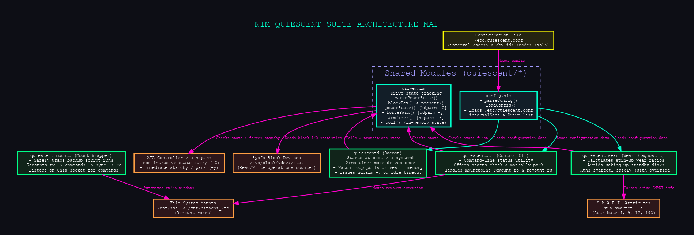
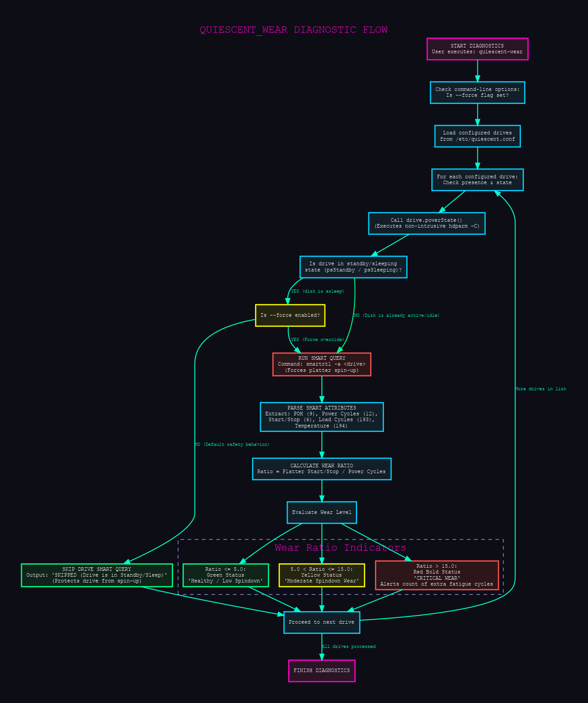

# quiescent — Nim Implementation Suite

[](src)
[](https://en.wikipedia.org/wiki/Linux)
[](#)
[](#)
[](#)
[](#)
[](#)

A modern, typed, and fully encapsulated implementation of the quiescent disk power management watcher as a suite of compiled binaries. 

The Nim implementation offers type safety, compile-time checks, and cleaner modular boundaries compared to shell oneshot watchers.

---

## Architecture Overview

The Nim suite divides operations into a background daemon (`quiescentd`), a command-line controller (`quiescentctl`), a non-intrusive SMART diagnostics wear analyzer (`quiescent_wear`), and an automated remount-on-demand wrapper (`quiescent_mountd`). A trio of read-only investigative CLIs (`spinup-probe`, `quiescent-metrics`, `mount-audit`) round out the suite.


*(Vector Graphic: [assets/nim_quiescent_architecture.svg](assets/nim_quiescent_architecture.svg))*

---

## 1. The Nim Utilities

### 🛡️ `quiescentd` (The Spindown Daemon)
* **Description**: A single long-running background daemon that loads the configuration once at startup, arms timer-mode drives, and runs an in-memory watch-loop for timer-ignoring drives.
* **Key Features**: 
  * Keeps all state (last IO operations, idle timing windows) in private fields in memory.
  * No file I/O or state writes in `/run` are generated during normal poll loops, preventing wake-ups of the root/system partitions.

### 🛠️ `quiescentctl` (Control & Management CLI)
* **Description**: An interactive CLI utility designed to query status, manually spin down disks, or toggle filesystem read-only/read-write permissions.
* **Usage**:
  ```bash
  quiescentctl status                 # Display status table of all configured drives
  quiescentctl park <drive_by_id>     # Force immediate ATA Standby (spindown)
  quiescentctl remount-ro <mount>     # Remount partition to read-only (ro)
  quiescentctl remount-rw <mount>     # Remount partition to read-write (rw)
  ```

### 🧠 `quiescent_wear` (Non-Intrusive SMART Analyzer)
* **Description**: Calculates start/stop cycles and evaluates drive fatigue by comparing physical platter spin-ups (`Start_Stop_Count`) to full system boots (`Power_Cycle_Count`).
* **Safe Polling Flow**: Checks drive status first; **skips standby/sleeping disks** to prevent them from spinning up. Use `--force` to override.


*(Vector Graphic: [assets/nim_wear_smart_flow.svg](assets/nim_wear_smart_flow.svg))*

### 🔄 `quiescent_mountd` (Remount-on-Demand Automation)
* **Description**: Automation wrapper that remounts quiescent disks to `rw` only when write operations (like backup scripts) need to run, and immediately closes the window.
* **Usage**:
  ```bash
  # Execute rsync within a safe, temporary Read-Write window:
  quiescent_mountd run -m /mnt/sda1 -c "rsync -a /source/ /mnt/sda1/"
  
  # Alternatively, run as a background daemon listening on a Unix Socket:
  quiescent_mountd listen
  ```

### 🔎 `spinup-probe` · `quiescent-metrics` · `mount-audit` (Shutdown Spin-Up Trio)
Three read-only CLIs sharing the same `Drive` / `PowerState` / `byId` model, born from the
2026-06-11 shutdown spin-up investigation (see [`../LESSONS_LEARNED.md`](../LESSONS_LEARNED.md)
§7 and [`../FUTURE_DIRECTIONS.md`](../FUTURE_DIRECTIONS.md) §3/§7).

| Tool | What it answers | Root? |
|------|-----------------|-------|
| `spinup-probe` | Which mounts were *spun up* at recent shutdowns? (unmount duration = standby→active proxy) | no |
| `quiescent-metrics` | Power state + last-shutdown spin-up as Prometheus textfile metrics | only if `hdparm` needs it |
| `mount-audit` | Which managed drives are mounted **rw** and could go read-only for a zero-spin-up shutdown? | no |

```bash
./spinup-probe --boots 3                 # per-boot table; --prefix /mnt/ (default), --all
./mount-audit /etc/quiescent.conf        # drive | dev | mountpoint | ro/rw | recommendation
./quiescent-metrics /etc/quiescent.conf > /var/lib/node_exporter/textfile/quiescent.prom
```

`spinup-probe` and `mount-audit` are read-only and need no root (journal access needs the
`systemd-journal` group; `/proc/mounts` is world-readable). `quiescent-metrics` reads power
state via the non-intrusive `hdparm -C` (never wakes a parked drive) and restricts its
spin-up series to mounts backed by a managed drive so the textfile stays low-cardinality.
Both new parsers — `quiescent/journal.nim` (unmount durations) and `quiescent/mountinfo.nim`
(`/proc/mounts`) — are pure (string in → value out) and unit-tested.

---

## 2. Configuration (`/etc/quiescent.conf`)

Configuration is whitespace-separated. Lines starting with `#` are ignored. 

```ini
# Core daemon poll interval (cadence to poll watch-mode drives)
interval 60

# --- Timer Mode ---
# Device by-id symlink                           Mode   ATA Standby Value (-S)
/dev/disk/by-id/ata-Hitachi_HUA723020ALA640_...  timer  12

# --- Watch Mode (For surveillance drives ignoring hardware timers) ---
# Device by-id symlink                           Mode   Required Idle Seconds
/dev/disk/by-id/ata-WDC_WD10EURX-63UY4Y0_...     watch  300
```

---

## 3. Build & Installation

### Build
Requires the Nim compiler (version >= 2.0.0) and `nimble`:
```bash
cd nim
nimble build
```
This compiles the standalone binaries in the `nim/` directory: `quiescentd`, `quiescentctl`,
`quiescent_wear`, `quiescent_mountd`, plus the read-only trio `spinup-probe`,
`quiescent-metrics`, and `mount-audit`.

### Install
Installs the daemon, command utilities, and registers the systemd service:
```bash
# Install binaries
sudo install -m 0755 quiescentd quiescentctl quiescent_wear quiescent_mountd /usr/local/bin/

# Install and start Systemd service
sudo install -m 0644 systemd/quiescentd.service /etc/systemd/system/
sudo systemctl daemon-reload
sudo systemctl enable --now quiescentd.service

# Verify daemon logs
journalctl -u quiescentd.service -f
```

### Tests
```bash
nimble test        # pure parsers: journal (unmount durations) + mountinfo (/proc/mounts)
```

---

## 4. Why the Nim Port excels over Shell scripting

| Feature | Shell Watcher (`idle-disk-park.sh`) | Nim Port (`quiescentd`) |
| :--- | :--- | :--- |
| **State Storage** | File writes in `/run/` on disk | In-memory private objects |
| **Typing** | String matching | Strongly typed `PowerState` and `Mode` enums |
| **Performance** | Spawns multiple subprocesses | Single compiled long-running daemon |
| **Testing** | Tight coupling with I/O | Pure parsing library (`parseConfig`) |
| **Deployment** | Requires cron/systemd-timers | Standard systemd service daemon |
