# Quiescent System Visualizations Catalog

This folder contains a comprehensive gallery of **25 custom architecture maps, transition flowcharts, and hardware diagnostic diagrams** that describe the quiescent standby system design, daemon codebase mechanics, OS storage boundaries, and Git repository operations.

All diagrams are styled with a dark background and neon high-visibility styling to match bare-metal system architecture aesthetics.

---

## Part 1: Daemon & Polling Orchestration (01-05)

### 01. Daemon Watch Loop Flow (`01_daemon_mainloop_flow`)
Visualizes the watch-loop polling algorithm of `quiescentd.nim` monitoring disk states in-memory.
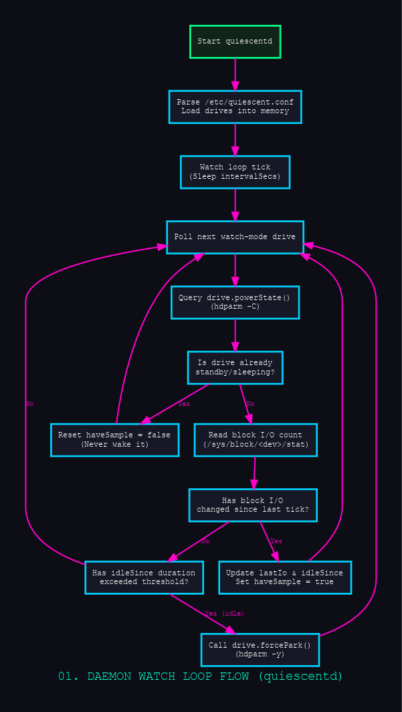
* [SVG Vector](01_daemon_mainloop_flow.svg) | [DOT Source](01_daemon_mainloop_flow.dot)

### 02. Drive Module Encapsulation (`02_drive_encapsulation_boundaries`)
Maps the library API visibility boundaries (`*` exported vs module-private symbols) inside `drive.nim`.
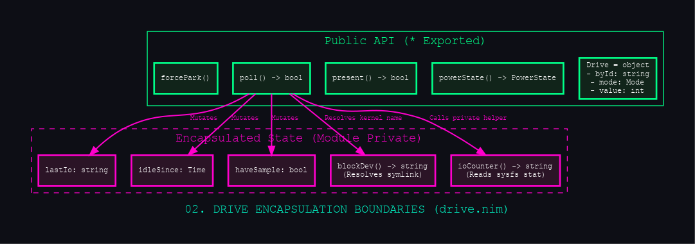
* [SVG Vector](02_drive_encapsulation_boundaries.svg) | [DOT Source](02_drive_encapsulation_boundaries.dot)

### 03. Config Syntax Parsing Pipeline (`03_config_syntax_parsing`)
Traces the whitespace-delimited parsing logic of `/etc/quiescent.conf` within `config.nim`.
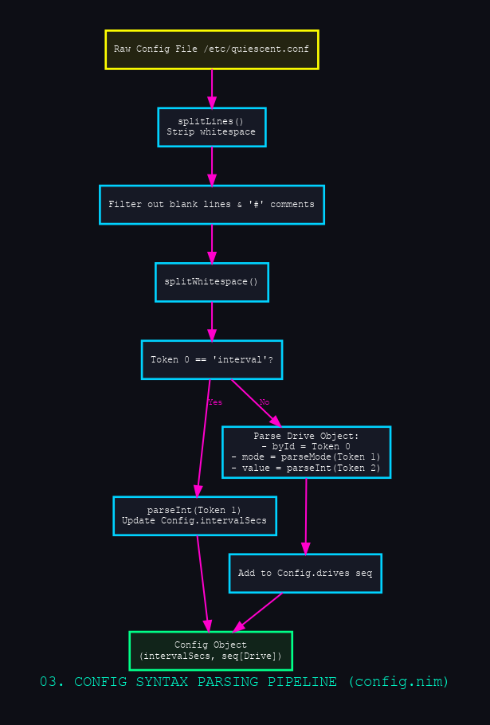
* [SVG Vector](03_config_syntax_parsing.svg) | [DOT Source](03_config_syntax_parsing.dot)

### 04. Interval Scheduling & Sleep Jitter (`04_interval_scheduling_jitter`)
Illustrates thread sleep cycles and OS scheduling latency offsets in the watchdog timer.
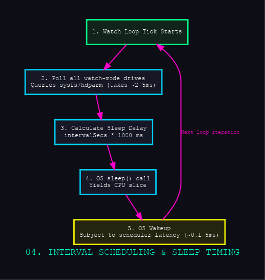
* [SVG Vector](04_interval_scheduling_jitter.svg) | [DOT Source](04_interval_scheduling_jitter.dot)

### 05. Policy Execution Models: Timer vs Watch (`05_timer_vs_watch_execution`)
Compares hardware self-spindown (`mTimer`) against daemon-controlled forced spindown (`mWatch`).
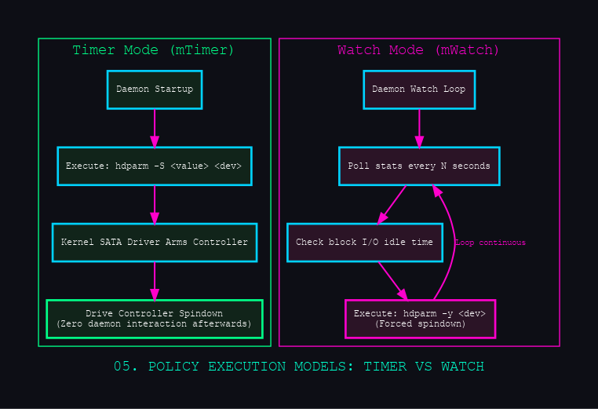
* [SVG Vector](05_timer_vs_watch_execution.svg) | [DOT Source](05_timer_vs_watch_execution.dot)

---

## Part 2: Operating System & Hardware Interfaces (06-10)

### 06. Sysfs Block I/O Telemetry Interface (`06_sysfs_io_telemetry`)
Shows the formatting and fields parsed from `/sys/block/<dev>/stat` to compute idle times.
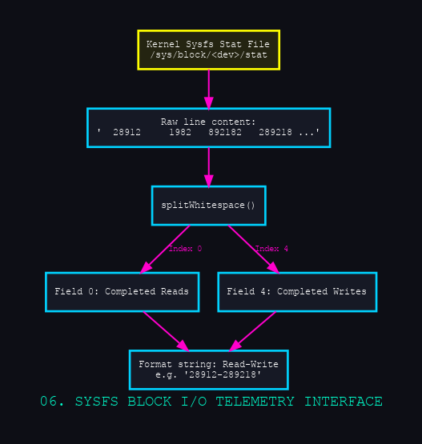
* [SVG Vector](06_sysfs_io_telemetry.svg) | [DOT Source](06_sysfs_io_telemetry.dot)

### 07. hdparm / ATA Commands Mapping (`07_ata_commands_mapping`)
Maps Nim functions to their matching CLI utility and raw ATA commands (`CHECK POWER`, `STANDBY IMMEDIATE`, `STANDBY TIMER`).
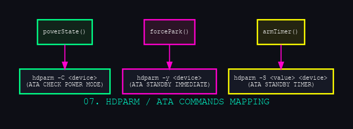
* [SVG Vector](07_ata_commands_mapping.svg) | [DOT Source](07_ata_commands_mapping.dot)

### 08. Stable by-id Symlink Resolution (`08_disk_symlink_resolving`)
Details the resolution process from stable `/dev/disk/by-id/` symlinks to kernel names (e.g. `sde`).
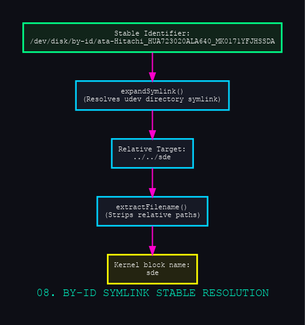
* [SVG Vector](08_disk_symlink_resolving.svg) | [DOT Source](08_disk_symlink_resolving.dot)

### 09. SMART Attributes Extraction Map (`09_smartctl_attribute_parsing`)
Examines the specific SMART parameter attributes retrieved via `smartctl` for drive wear diagnostics.
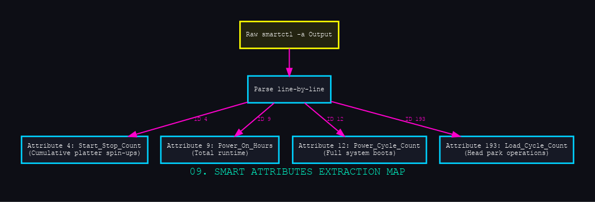
* [SVG Vector](09_smartctl_attribute_parsing.svg) | [DOT Source](09_smartctl_attribute_parsing.dot)

### 10. Systemd Service Unit Dependencies (`10_systemd_unit_dependencies`)
Illustrates system start order ordering (`After=local-fs.target` and target requirements).
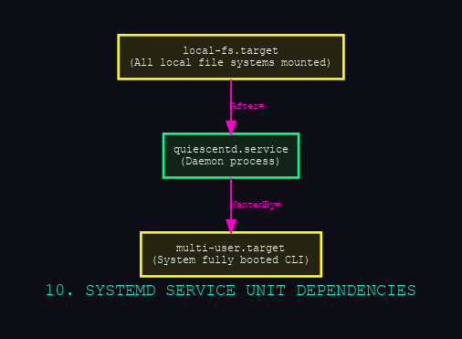
* [SVG Vector](10_systemd_unit_dependencies.svg) | [DOT Source](10_systemd_unit_dependencies.dot)

---

## Part 3: Quiescent Power States & Wear Mechanics (11-15)

### 11. Hard Drive Power State Transitions (`11_disk_power_state_transitions`)
The state machine detailing disk platter spin-up delays and standby/sleep power changes.
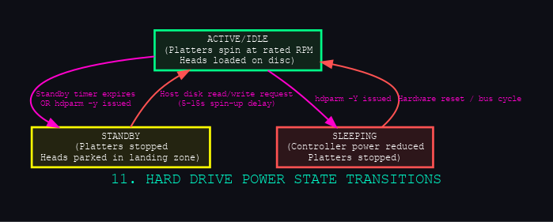
* [SVG Vector](11_disk_power_state_transitions.svg) | [DOT Source](11_disk_power_state_transitions.dot)

### 12. Spindown Fatigue & Wear Mathematics (`12_spindown_fatigue_math`)
Illustrates wear ratio calculations from physical start/stops and power cycles.
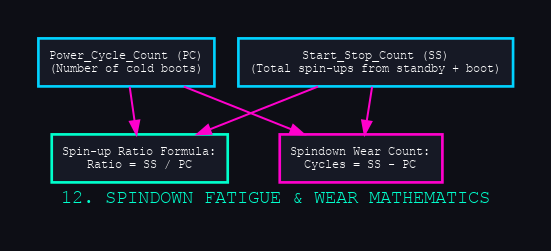
* [SVG Vector](12_spindown_fatigue_math.svg) | [DOT Source](12_spindown_fatigue_math.dot)

### 13. Platter Wear Mechanics: Steady State vs Spin-up (`13_platter_wear_cycles`)
Explains bearing lubrication wear during torque transitions versus frictionless active rotation.
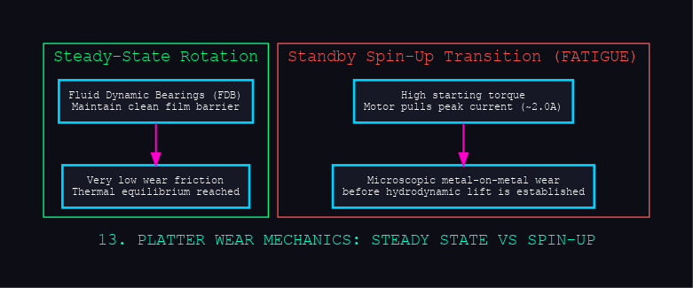
* [SVG Vector](13_platter_wear_cycles.svg) | [DOT Source](13_platter_wear_cycles.dot)

### 14. WD AV-GP Surveillance Timer Ignorance (`14_surveillance_drive_timers`)
Explains why surveillance firmware ignores standard ATA commands and stays active 24/7.
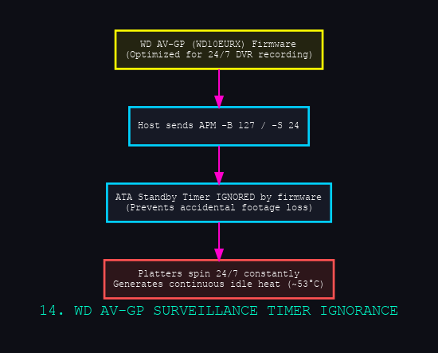
* [SVG Vector](14_surveillance_drive_timers.svg) | [DOT Source](14_surveillance_drive_timers.dot)

### 15. Active-Idle vs Standby Thermal Footprint (`15_active_idle_power_diff`)
Compares wattage and temperatures for spinning active/idle modes vs quiescent standby.
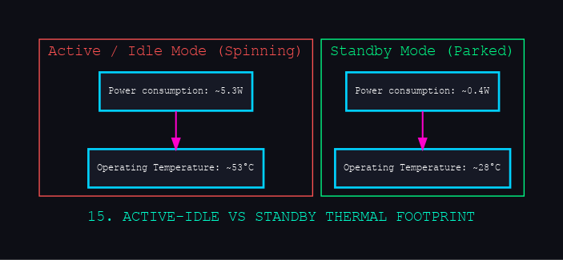
* [SVG Vector](15_active_idle_power_diff.svg) | [DOT Source](15_active_idle_power_diff.dot)

---

## Part 4: Write-Window Automation & Filesystems (16-20)

### 16. Write-Window Lifecycle (`16_write_window_lifecycle`)
Details the temporary read-write window flow executed by the mount automation tool.
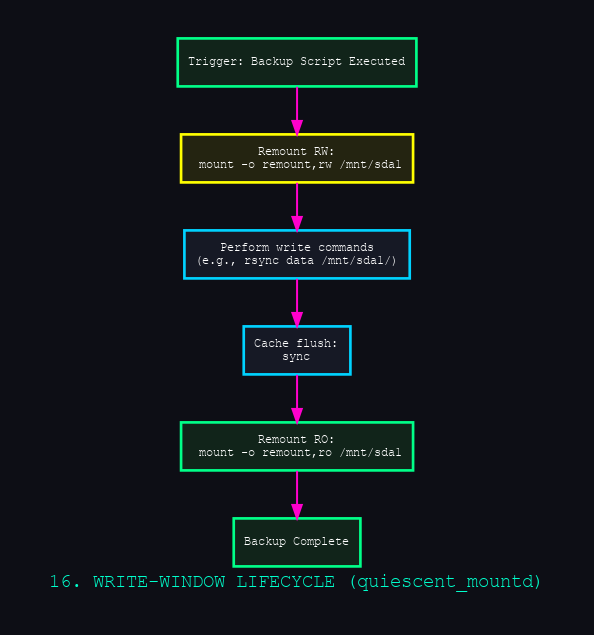
* [SVG Vector](16_write_window_lifecycle.svg) | [DOT Source](16_write_window_lifecycle.dot)

### 17. Ext4 Unmount Write Signature Analysis (`17_ext4_unmount_write_signature`)
Explains how unmounting a read-write filesystem forces platter spin-up to flush journal states.
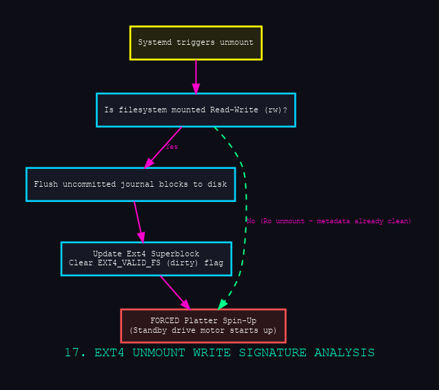
* [SVG Vector](17_ext4_unmount_write_signature.svg) | [DOT Source](17_ext4_unmount_write_signature.dot)

### 18. Fsck Dependency Failure Sequence (`18_fsck_dependency_failures`)
Explains system boot aborts when fsck returns errors on block devices.
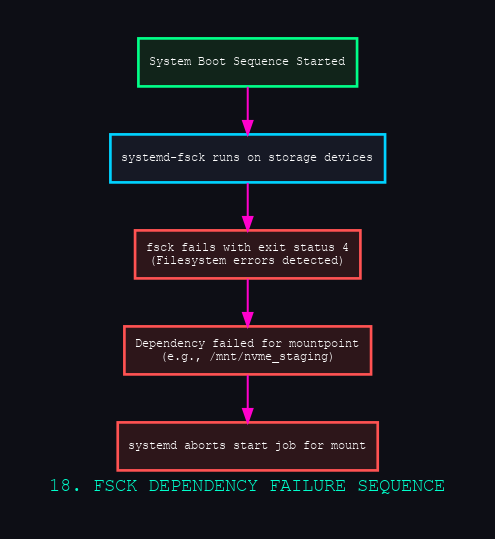
* [SVG Vector](18_fsck_dependency_failures.svg) | [DOT Source](18_fsck_dependency_failures.dot)

### 19. Fstab Mount Option Impact on Platter Spin (`19_fstab_options_impact`)
Compares `defaults` (write on unmount) vs `ro,noatime,nofail` (instant unmount) options.
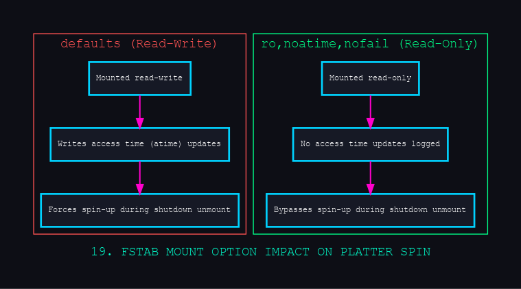
* [SVG Vector](19_fstab_options_impact.svg) | [DOT Source](19_fstab_options_impact.dot)

### 20. Mount Control Socket Interface (`20_mount_socket_api`)
Maps API interactions over the `/run/quiescent_mountd.sock` local Unix socket.
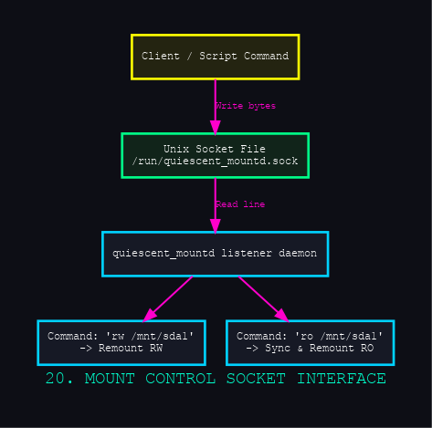
* [SVG Vector](20_mount_socket_api.svg) | [DOT Source](20_mount_socket_api.dot)

---

## Part 5: Lessons Learned & Anomalies (21-25)

### 21. Git Repository Object Repair Pipeline (`21_git_repository_repair_workflow`)
Flowchart of the filter-branch, reflog expiration, and garbage collection repair workflow.
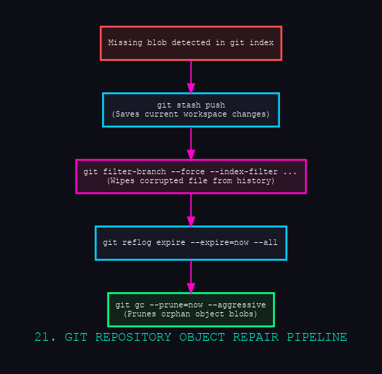
* [SVG Vector](21_git_repository_repair_workflow.svg) | [DOT Source](21_git_repository_repair_workflow.dot)

### 22. Git Repo Nested Workspace Drift (`22_submodules_drift_anomalies`)
Visualizes modified/untracked files in Hermes, Iron Cross, and Netdata submodules.
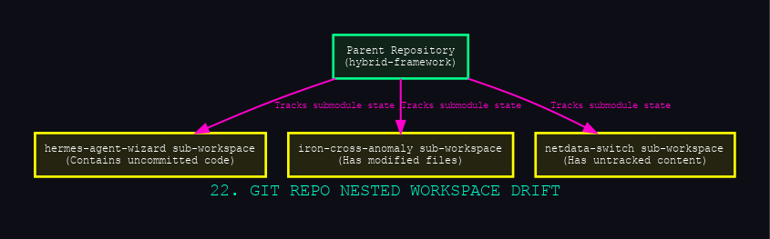
* [SVG Vector](22_submodules_drift_anomalies.svg) | [DOT Source](22_submodules_drift_anomalies.dot)

### 23. Masked nm-dispatcher Failure During Shutdown (`23_masked_dispatcher_failure`)
Steps showing D-Bus failures when NetworkManager calls the masked dispatcher service.
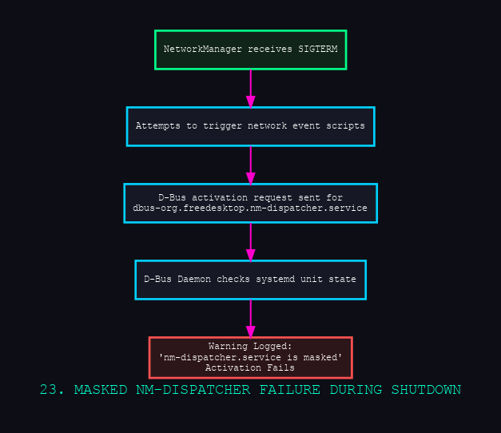
* [SVG Vector](23_masked_dispatcher_failure.svg) | [DOT Source](23_masked_dispatcher_failure.dot)

### 24. Systemd Transaction Destructive Conflicts (`24_resolved_transaction_conflicts`)
Compares start/stop job contradiction rejections in D-Bus during shutdown states.
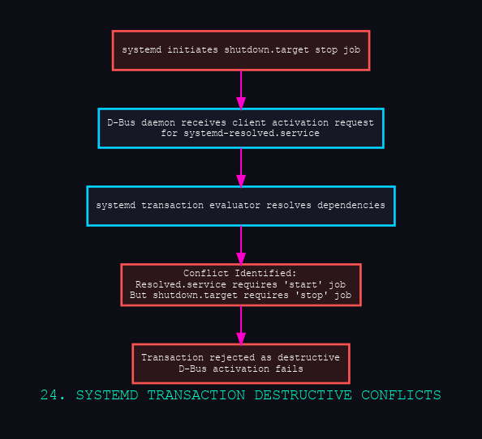
* [SVG Vector](24_resolved_transaction_conflicts.svg) | [DOT Source](24_resolved_transaction_conflicts.dot)

### 25. End-to-End Future Automated Backup Sequence (`25_future_backup_orchestration`)
The proposed secure backup workflow integrating read-only default mounting and automatic spin-down.
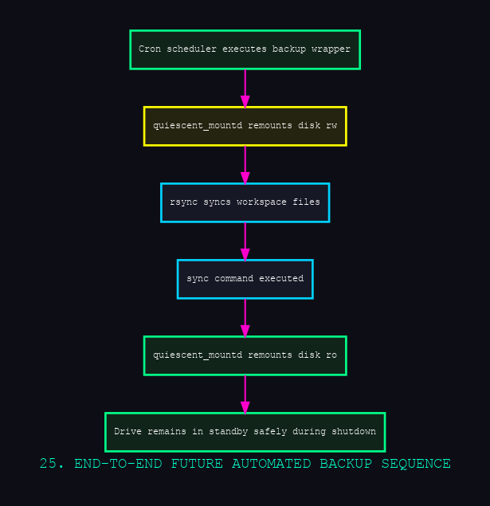
* [SVG Vector](25_future_backup_orchestration.svg) | [DOT Source](25_future_backup_orchestration.dot)
